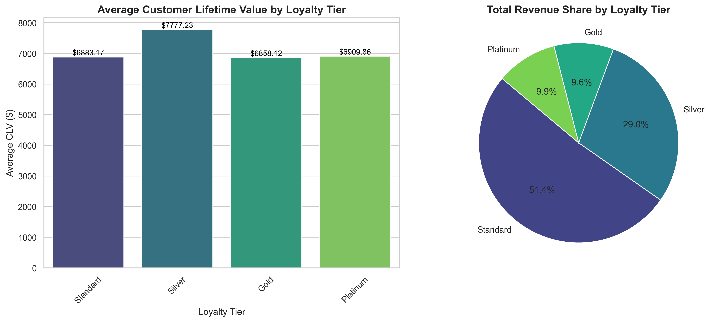

# Travel CX - Customer Lifetime Value (CLV) Analysis

##  Overview
A Python-based data analysis project demonstrating the extraction, manipulation, and visualization of customer data directly from a Microsoft SQL Server database. This analysis calculates the Customer Lifetime Value (CLV) across different loyalty tiers to identify high-value customer segments.

##  Tech Stack
- **Database:** Microsoft SQL Server (`TravelCx_Analytics`)
- **Language:** Python (Jupyter Notebook)
- **Libraries:** `pandas` (Data Manipulation), `pyodbc` (SQL Connection), `matplotlib` & `seaborn` (Data Visualization)

##  Interactive Notebook
You can view the complete code, data tables, and visualizations directly in the Jupyter Notebook:
[Open TravelCX-Analysis.ipynb](TravelCX-Analysis.ipynb)

##  Key Business Insights
1. **Average CLV by Tier:** Higher loyalty tiers (Platinum/Gold) generate significantly more lifetime value per customer.
2. **Revenue Distribution:** Analysis clearly shows which customer segments drive the majority of company revenue.
3. **Data-Driven Decisions:** These insights help optimize loyalty program ROI and target marketing strategies effectively.

## Analysis Output

## Project Files
- `TravelCX-Analysis.ipynb`: The complete, executable Jupyter Notebook containing SQL extraction, Pandas analysis, and visualizations in a single streamlined workflow.
- `TravelCX_CLV_Analysis.png`: Static export of the final visualization.
